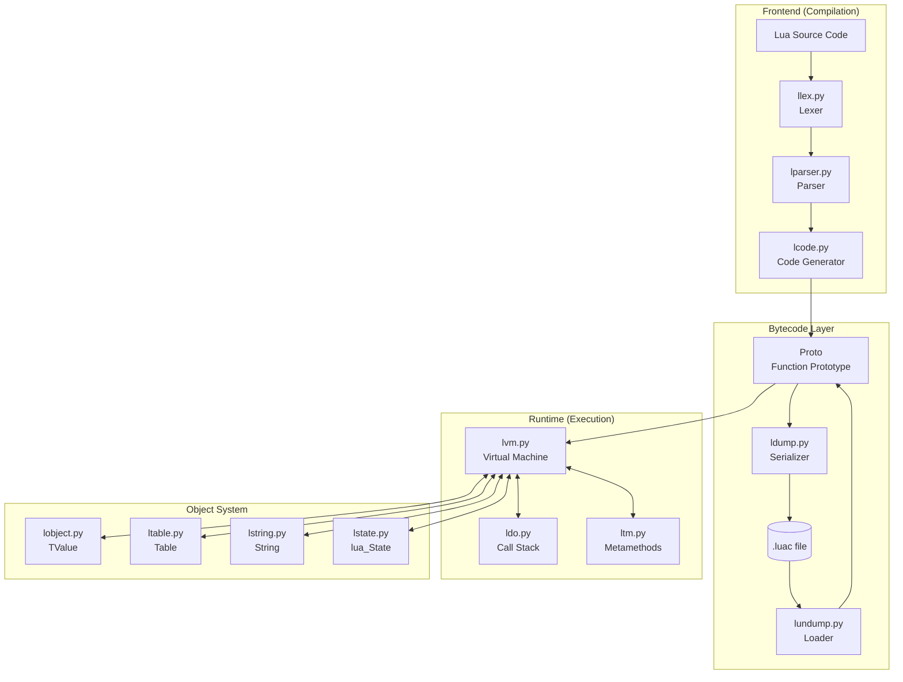
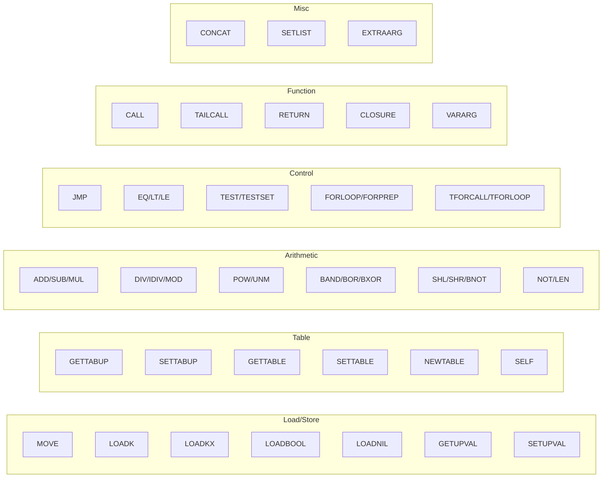

<p align="center">
  
</p>

<h1 align="center">PyLua</h1>

<p align="center">
  <strong>A Python reimplementation of the official Lua 5.3.6 virtual machine</strong>
</p>

<p align="center">
  <em>Faithfully porting the original C implementation to Python — from lexer to VM execution</em>
</p>

---

## About

PyLua is a **pure Python reimplementation** of the [official Lua 5.3.6](https://www.lua.org/ftp/lua-5.3.6.tar.gz) interpreter. We study and port the original C source code (`lua-5.3.6/src/`) to Python, maintaining the same architecture, algorithms, and module structure. This is not a binding or wrapper — every component is reimplemented from scratch based on the official source.

## What We Implemented

### Compilation Frontend

| Component | Source | Description |
|-----------|--------|-------------|
| **Lexer** | `llex.c` → `llex.py` | Complete tokenization: keywords, operators, numbers (int/float/hex), strings (short/long), comments |
| **Parser** | `lparser.c` → `lparser.py` | Recursive descent parser with operator precedence, scope management, local/upvalue binding |
| **Code Generator** | `lcode.c` → `lcode.py` | Register allocation, constant folding, jump patching, bytecode emission |

### Bytecode System

| Component | Source | Description |
|-----------|--------|-------------|
| **Opcodes** | `lopcodes.c` → `lopcodes.py` | All 47 Lua 5.3 instructions with encoding/decoding |
| **Dumper** | `ldump.c` → `ldump.py` | Binary chunk serialization (`.luac` format) |
| **Undumper** | `lundump.c` → `lundump.py` | Binary chunk loading with header validation |

### Runtime System

| Component | Source | Description |
|-----------|--------|-------------|
| **VM** | `lvm.c` → `lvm.py` | Register-based instruction dispatch, arithmetic, comparisons, table operations |
| **Call Stack** | `ldo.c` → `ldo.py` | CallInfo management, protected calls (`pcall`), tail call optimization |
| **Metamethods** | `ltm.c` → `ltm.py` | Complete tag method system (`__index`, `__add`, `__call`, etc.) |

### Object System

| Component | Source | Description |
|-----------|--------|-------------|
| **Values** | `lobject.c` → `lobject.py` | TValue representation: nil, boolean, number, string, table, function, userdata |
| **Tables** | `ltable.c` → `ltable.py` | Hash + array hybrid implementation |
| **Strings** | `lstring.c` → `lstring.py` | String interning |
| **State** | `lstate.c` → `lstate.py` | lua_State, global environment, registry |

### Standard Library

| Library | Functions |
|---------|-----------|
| **base** | `print`, `type`, `tostring`, `tonumber`, `pairs`, `ipairs`, `next`, `assert`, `error`, `pcall`, `xpcall`, `select`, `setmetatable`, `getmetatable`, `rawget`, `rawset`, `rawlen` |
| **math** | `abs`, `ceil`, `floor`, `max`, `min`, `sqrt`, `sin`, `cos`, `tan`, `exp`, `log`, `random`, `randomseed` |
| **string** | `len`, `sub`, `byte`, `char`, `rep`, `reverse`, `upper`, `lower`, `format`, `find`, `gsub`, `match` |
| **table** | `insert`, `remove`, `concat`, `sort`, `pack`, `unpack` |

## Architecture



## Instruction Set

All 47 Lua 5.3 VM instructions implemented:



## Metamethod Support

Complete implementation of Lua 5.3 metamethods:

| Category | Metamethods |
|----------|-------------|
| **Arithmetic** | `__add`, `__sub`, `__mul`, `__div`, `__mod`, `__pow`, `__unm`, `__idiv` |
| **Bitwise** | `__band`, `__bor`, `__bxor`, `__bnot`, `__shl`, `__shr` |
| **Comparison** | `__eq`, `__lt`, `__le` |
| **Table Access** | `__index`, `__newindex`, `__len` |
| **Other** | `__call`, `__tostring`, `__concat`, `__gc`, `__pairs`, `__ipairs` |

## Closure & Upvalue

Correct lexical scoping implementation:

```lua
function counter()
    local count = 0
    return function()
        count = count + 1
        return count
    end
end

local c = counter()
print(c())  -- 1
print(c())  -- 2
```

- **Upvalue capture**: Inner functions correctly capture outer locals
- **Upvalue sharing**: Sibling closures share the same upvalue
- **Close semantics**: Upvalues migrate to heap when block exits

## Binary Compatibility

PyLua generates bytecode in the same binary format as official `luac`:

- **Header**: Lua signature, version, format, endianness, sizes
- **Function prototype**: Instructions, constants, upvalues, nested protos
- **Debug info**: Line numbers, local names, upvalue names

Files compiled by PyLua can be loaded by standard Lua, and vice versa.

## Technical Highlights

### Faithful Port
Every module mirrors the original C structure. Function names, variable names, and algorithms follow `lua-5.3.6/src/` for correctness verification.

### Expression Handling
- Multi-return: `a, b, c = f()`
- Varargs: `function f(...) return ... end`
- Short-circuit: `x = a and b or c`
- Table constructors: `{[f()] = g(), ...}`

### Scope Semantics
- Block-level locals with proper shadowing
- Goto/label with scope validation
- For-loop variable semantics
- Upvalue close on block exit

### Debug Information
Full debug info generation:
- Source line mapping for each instruction
- Local variable names and active ranges
- Upvalue names for debugging

## Reference

This project is a study and reimplementation of the official [Lua 5.3.6 source code](https://www.lua.org/ftp/lua-5.3.6.tar.gz). All credit for the original design goes to the Lua team at PUC-Rio.
